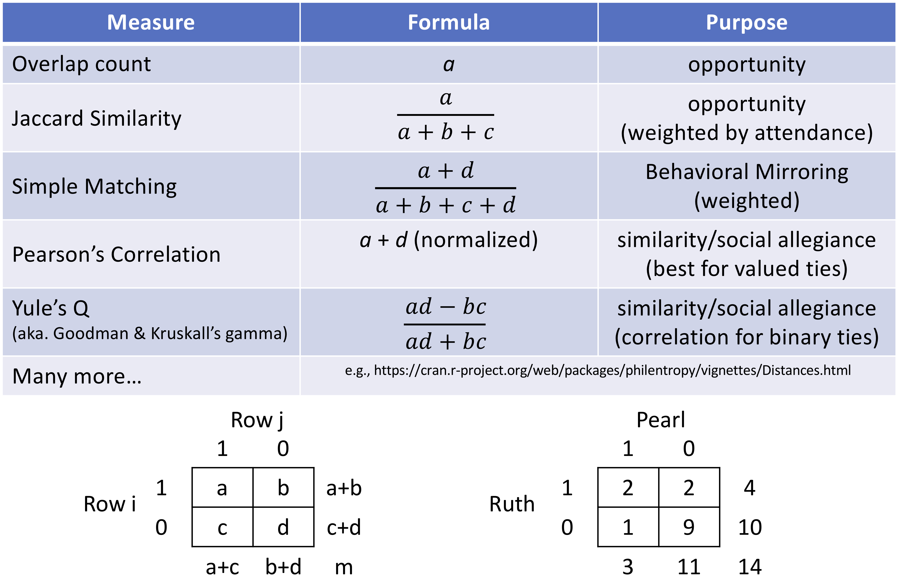

```{r setup, include=FALSE}

knitr::opts_chunk$set(echo = TRUE)

knitr::opts_chunk$set(
	message = FALSE,
	warning = FALSE,
	include = TRUE
)

```
### Content

  - Load packages
  - Load the network data
  - Creating network objects
  - Plotting a Two-Mode Network using `baseR`
  - Analytic option 1: Proceed as one-mode network
  - Analytic option 2: Proceed as two-mode network
  - Analytic option 3: Transform one-mode to two-mode
  
### Load igraph
```{r}

library(igraph)

```

### Load the network data

```{r}
## Load two-mode network

twomode <- read.csv2("Data/2mode.csv", header=TRUE)
head(twomode)
rownames(twomode) <- twomode$X
twomode$X <- NULL

```

The rows are policy actors in the Swiss climate policy network in period between 2008-13 and the columns are the events that they attended. This is a two-mode matrix.

### Transform to networks

Recall that, for this to be a two-mode network, ties should exist only between modes, and not within modes. In this case, that means that ties are only possible between policy actors and events, not between actors and actors or between events and events.

Because igraph does not automatically recognize two-mode networks, it is necessary to tell igraph that there are two types of vertices. You can use the function `graph_from_incidence_matrix()`.

```{r}
## Transform into igraph object

# create matrices
twomode.mat <- as.matrix(twomode)

# create network
twomode.net <- graph_from_incidence_matrix(twomode.mat, weighted = TRUE) # the network contains information in who is passive, active or leading; Recall APES!!
twomode.net
list.edge.attributes(twomode.net)

```

### Plotting a two-mode matrix using ´baseR´

#### Very basic plots

There are a range of options for visualizing two-mode networks. 

What follows are just a few of the basic options for visualizing networks in two-modes.

```{r}

plot(twomode.net)

# Adjusting labels 

plot(twomode.net, vertex.label.cex = 0.5, vertex.label.color = "black") # size and color of all labels

```
#### `V(g)$color` and `V(g)$shape`

Since we're dealing with two different kinds of vertices in a bipartite network, the first thing we should do is make identification of the type of each vertex more visually intuitive

Let's do this using color and shape using the ´ifelse()´ function.

```{r}

V(twomode.net)$color <- ifelse(V(twomode.net)$type, "lightblue", "salmon") # color of nodes
V(twomode.net)$shape <- ifelse(V(twomode.net)$type, "circle", "square") # shape of nodes
E(twomode.net)$color <- "lightgray"
  
plot(twomode.net, vertex.label.cex = 0.5, vertex.label.color = "black")

```

#### Further tweaks 
```{r}

V(twomode.net)$color <- ifelse(V(twomode.net)$type, "lightblue", "salmon") # color of nodes
V(twomode.net)$shape <- ifelse(V(twomode.net)$type, "circle", "square") # shape of nodes
E(twomode.net)$color <- "lightgray"
  
plot(twomode.net, vertex.label.cex = 0.5, vertex.frame.color = "gray", vertex.label.color = "black")

```

#### Layouts

```{r}
plot(twomode.net, vertex.label.cex = 0.5, vertex.frame.color = "gray", 
    vertex.label.color = "black", layout=layout_with_graphopt)

```
```{r}
plot(twomode.net, vertex.size = 1, vertex.label.cex = 0.5, vertex.frame.color = "gray", 
    vertex.label.color = "black", layout=layout.bipartite)
```

### Analytic Options for Two-Mode Networks

Two-mode networks can be very rewarding to study. But, they are also somewhat of a challenge, as their analysis is still not well defined. Below, we present three options for analyzing two-mode networks.

- Pretend like they are one-mode networks and analyze as usual
- Analyze each mode independently using metrics that are specialized for use with two-mode networks
- Convert the two-mode network to two one-mode networks and analyze them as usual

Each of the above options has its trade-offs and strengths. For a larger discussion of these trade-offs, see this week's readings. For a description of how to do each, we'll approach each option in order.

#### Analytic option 1: Pretend that two-mode networks are one-mode networks

Igraph was not designed with two-mode networks in mind. It does, however recognize that the network is two-mode. Keep in mind, however, that when you run centrality measures on a two-mode network, igraph will be treating each of these nodes as though they are in the same mode. Igraph makes no allowance for calculating centralities that are specific to the special case of two-mode networks.

If you are interested in understanding the relative prominence of nodes in each mode, relative to other nodes in that mode, then the best you will be able to do in igraph is to analyze each mode separately. For more on that, see the following two sections.

```{r}

types <- V(twomode.net)$type  ## getting each vertex `type` let's us sort easily
deg <- degree(twomode.net, mode = "all", normalized = TRUE)
bet <- betweenness(twomode.net, directed = FALSE, normalized = TRUE)
clos <- closeness(twomode.net, mode = "all", normalized = TRUE)
eig <- eigen_centrality(twomode.net)$vector

## TIP: Check the default settings of the R functions.

cent_df <- data.frame(types, deg, bet, clos, eig)

cent_df_ordered <- cent_df[order(cent_df$type, decreasing = TRUE),] ## sort w/ `order` by `type`

```

##### Adjust vertices by centrality

```{r}

V(twomode.net)$size <- degree(twomode.net)
V(twomode.net)$label.cex <- degree(twomode.net) * 0.03

plot(twomode.net, vertex.frame.color = "gray", 
    vertex.label.color = "black", layout = layout_with_graphopt)
```

### Analytic option 2: Proceed as two-mode network

There are presently few options for analyzing two-mode networks in R. One of the more established options will be to use Tore Opsahl's tnet package. You can find more information about tnet, as well as many other two-mode network analysis ideas [on Tore's blog:] (https://toreopsahl.com/2009/06/12/tnet-software-for-analysing-weighted-networks/) https://toreopsahl.com/

You can also find a lot of information about the package using the `?tnet` function.

To install tnet, just do as you usually would.

```{r}
# install.packages("tnet", dependencies=TRUE)
library(tnet)  # start tnet
```

__Working with the tnet data format__

When using tnet, keep in mind that it was not designed to work like igraph and it was not designed to work with igraph data objects. This means that you will have to convert the data that you have entered into igraph to work with tnet.

The tnet package expects the data to be formatted as a numeric __edgelis__t. Do not include names. Thankfully, producing a numeric edgelist from an igraph data object is fairly easy and quick using the ´get.edgelist()´ function in igraph.

To suppress the names that would normally exist in an edgelist like this, include the following argument: names=FALSE.

```{r}
tm<-get.edgelist(twomode.net, names=FALSE)
head(tm)  # check to make sure it worked
```

A notable inconvenience to using this particular data format is that it can be difficult to keep up with the names of the various nodes. To help with that, you can extract the labels of the nodes in the igraph data object for later use.

```{r, eval=FALSE, echo=TRUE}
NodeLabels <- V(twomode.net)$name
head(NodeLabels)   # Again, check
```

There is just one more thing to keep in mind as you work with `tnet`. The package only analyzes the first of the two modes (whichever one is in column one). To analyze the second mode, you will need to transpose the columns.

Here, we represented the transposed edgelist as "mt".
```{r}
mt <- tm[, c(2, 1)]
head(mt)
head(tm)

```

__Calculating centrality in `tnet`__

```{r}
deg_tm <- degree_tm(tm)
deg_mt <- degree_tm(mt)

deg_mt
deg_tm 
```

Okay, so the `tnet` package only defines how to calculate degree in a two-mode network. Other programs or packages, like UCINET, Pajek, or statnet have already defined two-mode centrality measures, with appropriate normalizations. 

In this case, however, Tore has explained that he feels that it is more appropriate to convert the two-mode network into a one-mode network with weighted ties and then analyze that. He has designed some methods for analyzing weighted centrality in one-mode networks (also included in tnet) for that purpose.

You may feel that this was a lot of buildup for very little payoff, and you are correct. But, we will be able to use tnet once we have completed the next section. This brings us to option 3: converting two-mode networks to one-mode networks for further analysis. We'll pick tnet back up at the end of option three.

In the tutorial, that you will replicate as an exercise, you will learn how to analyse twomodes in stanet.

### Analytic Option 3: Transforming 1-modes to 2-modes

Because igraph does not include measures that are designed specifically for use with two-mode data, you may wish to convert the two-mode network into two one-mode networks. So, if you have a network of actors and events, as we do here, you will be able to create a actor-by-actor network and an event-by-event network. These resulting networks may initially be valued to reflect similarity, opportunity, or simple overlaps in behavior. The tnet package is designed to handle weighted networks to produce measures of centrality, .

Alternatively, you may decide to binarize the networks in order to better reflect your own consideration of what should constitute a tie under the circumstances that you are researching.

There are several ways to convert a two-mode network. In this introduction, we will focus only on five: a simple count of overlaps, simple matching, Jaccard similarity, Pearson’s Correlation, and Yule’s Q. Although there are many, many options, these should give you a good start.

<font size="5"><span style="color:blue">Transformation options</span></font>
```{r, echo=FALSE, fig.cap=" ", out.width = '60%'}

```

To read the table, above, consider the two-by-two tables just below it. For each pair of nodes in one of the modes, we may count the number of nodes in the other mode to which they both have a connection: 

    a: the number of nodes in the other mode to which neither has a connection 
    d: and the number of nodes in the other mode to which one has a connection, but the other does not (b and c) 
    
For example, int the table we can see that that Ruth and Pearl attended two events in common (a). Similarly, there were nine events that neither attended (d). Also, Ruth attended two events that Pearl did not attend (c), and Pearl attended one event that Ruth did not (d).

We can use this information to calculate the potential for ties or overall similarities between actor and events in our co-occurence nentwork, or within modes of any two-mode network. We will treat each of the four methods listed above in the order that they appear in the table.

Note: This list is far from exhaustive. But, it should be a good place to start.

### Overlap count through manual projection 

This is a count of the number of nodes in the second mode that each pair in the first mode have in common, and visa versa. That is: a

#### First step: Convert to matrix

```{r}
bipartite_matrix <- as_incidence_matrix(twomode.net)
bipartite_matrix # note that we ignored the edge weights here!!!

```

#### Second step: Transpose

```{r}
t(bipartite_matrix)
```

#### Third step: Matrix multiplication

We use the Cross-Product Method with manual matrix multiplication. In short: we can multiply a two-mode matrix by its transpose to produce a one-mode network that reclects the ties between the nodes in one of the two modes.

To produce an (actor x actor) network, multiply the matrixby its transpose (AA'). To produce an (event x event), multiply the transposed network by the original (A'A). So, let’s try it.

We’re going to multiply the __transpose of bipartite_matrix (t(bipartite_mattrix))__ by the __original bipartite_matrix__ using the matrix multiplication operator `%*%` and assign the whole thing to a __new variable called person_matrix_prod__.


It doesn’t make any sense that there would be loops when projecting a bipartite network (as we would then be adding information that did not exist in the original network), so we want to set the diagonal of our result to 0. To do this, we use the `diag()` function with __person_matrix_prod__ as the argument.

```{r}
event_matrix_prod <- t(bipartite_matrix) %*% bipartite_matrix 
diag(event_matrix_prod) <- 0
```
We could this now, as well to produce the event x event matrix

```{r}
actor_matrix_prod <- bipartite_matrix %*% t(bipartite_matrix) 
diag(actor_matrix_prod) <- 0
```

#### Forth step: Network generation
```{r}
actor_actor <- graph_from_adjacency_matrix(actor_matrix_prod , 
                                        mode = "undirected", 
                                        weighted = TRUE)
plot(actor_actor)

event_event <- graph_from_adjacency_matrix(event_matrix_prod , 
                                        mode = "undirected", 
                                        weighted = TRUE)

plot(event_event)
```

### Jaccard Similarity

```{r}
# install.packages("ade4", dependencies = TRUE)
library(ade4) 
```

```{r, eval=FALSE, echo=TRUE}
actor_jaccard <- dist.binary(bipartite_matrix, method=1, upper=TRUE, diag = FALSE) # Method #1 is "Jaccard Index"
event_jaccard <- dist.binary(t(bipartite_matrix), method=1, upper=TRUE, diag = FALSE) 

actor_mat <- as.matrix(actor_jaccard)

actor_mat # Look at the matrix before you binarize

# actor_jaccard          
actor_jaccard <- ifelse(actor_mat<1 & actor_mat>0, 1, 0) # Binarize, please not that you could set here another threshold of course! What would that mean?

actor_jaccard

actor_actor <- graph_from_adjacency_matrix(actor_jaccard,    # Create an igraph network
                                        mode = "undirected")
plot(actor_actor)
```
