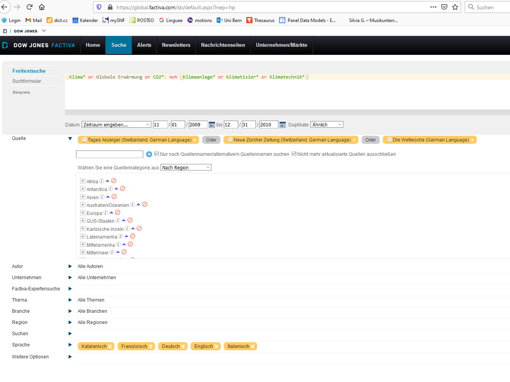
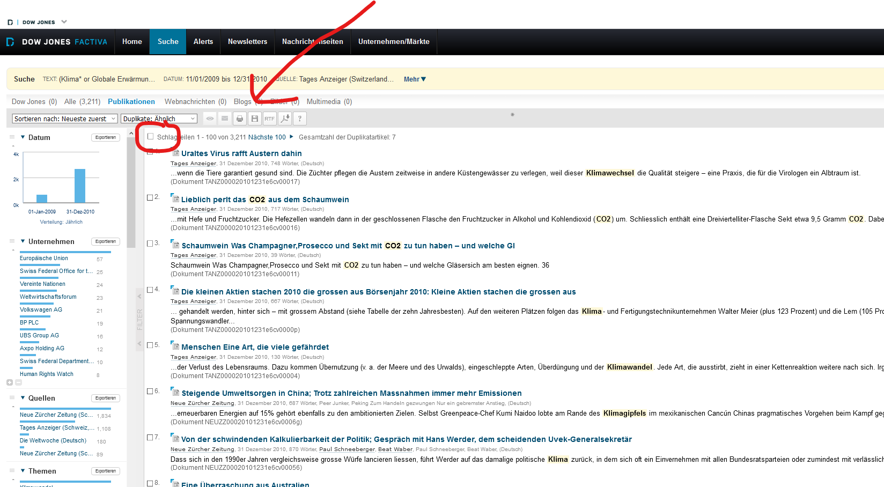
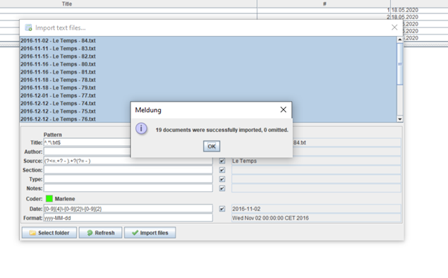

```{r setup, include=FALSE}

knitr::opts_chunk$set(echo = TRUE)

knitr::opts_chunk$set(
	message = FALSE,
	warning = FALSE,
	include = TRUE
)

```

# Discourse network analysis {.tabset}

In this script you will learn how to generate DNA data and how to analyze it. You can work on the different parts independently. 

- More information on the data generation process can be found here: https://www.researchgate.net/publication/353515331_COMPON_DNA_CODING_INSTRUCTIONS_Version_for_Switzerland.
- More information on the rDNA can be found here: https://github.com/leifeld/dna.

## Content

1. Search for articles in Factiva
2. Download search result from Factiva
3. Load them into the DNA software
4. Code them in the DNA software
5. Export your networks and covariables
6. Analyse them

## 1 Search for articles

To search for newspaper articles, you may for example use Factiva. As student, you have access to the Factiva Database in the university network (i.e. vpn). Go to: https://www.unibe.ch/universitaet/dienstleistungen/universitaetsbibliothek/recherche/datenbanken/index_ger.html?id=964.

Consider you want to search for newspaper articles published during and after the 2009 Kopenhagen climate conference in important Swiss newspaper outlets. 

As newspapers you could for example select TagesAnzeiger, Neue Zuercher Zeitung, Le Temps, and Weltwoche to cover most of the political spectrum in Switzerland. 

```{r, echo=FALSE, fig.cap=" ", out.width = '80%'}

```

## 2 Download serach result

Next, you need to check if your search string delivered the desired result. If so, you may continue downloading the articles. Select 100 articles and download them using the disk icon and select "article format". Then do a right-click and say save page. Your files need to be saved as html-files!!

You need to do this for all pages until the end of your research results. This is time consuming and I think about writing a scraper for this (but I haven't yet done so.)

```{r, echo=FALSE, fig.cap=" ", out.width = '80%'}

```

## 3 Load articles to DNA software

To prepare your articles for DNA coding some preparatory steps are needed. First, you need to filter your search result. Of course, you could use the built in facilities in Factiva to do this, but I would not advise you to do this, since you don't have any idea what kind of algorithms are behind these filter functions. Furthermore, we do not want to manually import all articles to the DNA tool. Thus, the following code can be used to select the most relevant articles and prepare those articles for automatic import to the DNA tool.

I have provide some newspaper articles that I have already downloaded from Factiva and saved as html-files.

### 3.1 Install and load all necessary packages
```{r}

# to install the packages...

# install.packages("devtools")
# devtools::install_github("koheiw/newspapers")

require(newspapers, quietly = TRUE)
library(tidyverse) 
library(stringr)
# install.packages("tm")
library(tm)
library(dplyr) 

```

### 3.2 read in files as .txt

Now, you can use this function to read in you html files into the R environment. To read in HTML files, you might need to adjust the respective file address; note that this is different for Mac and Windows.

Please, note that you need to download the articles in html format from factiva. To do so consult the manual for the search string and closely follow these instructions https://github.com/koheiw/newspapers on how to save those files. 

```{r}

dat = import_factiva("Data/html_files/") 

```

### 3.3 generate a safecopy, to avoid time-consuming loading of the articles several times (when rerunning parts of the script)

```{r}
dat_copy = dat
# dat$date <- as.Date(dat$date)
#### dat = dat_copy (this is just, when you need to redo something)
```

### 3.4 Select articles for further analysis ...

This is your choice! You need to carefully think, why you include or exclude articles for later analysis.

Here, I search for keywords in articles, count them and exclude all articles that have less than 500 words and contain less than 3 keywords. 

```{r}
klimawandel <- dat$body

key_count = sapply(c("Klima", "klima", "CO2", "climatique", "globale Erwärmung", "CO2-Gesetz", "CO2-Abgabe"), 
               function(i) str_count(klimawandel, i))

#### bind the results to the existing object transformed to dataframe

dat_key = as.data.frame(key_count)
dat = cbind(dat, dat_key)

# create variable that counts the number of those keywords; then create a variable that indicates if word count is 

dat = dat %>% 
  mutate(sum_keywords = Klima + klima + CO2 + climatique + `globale Erwärmung` + `CO2-Gesetz` + `CO2-Abgabe`) %>%
  mutate(above_500 = ifelse(length >= 500, 1, 0))

# save 

write.csv2(dat, "Results/dataset.csv")  # make sure that you adjust the file name and file serve!!!
```

Now, I create a subset of dat excluding excluding articles with less than 3 keywords and word count 500. This can be adjusted of course.

```{r}
dat_dna = subset(dat, dat$sum_keywords > "3" & dat$above_500 == "1")

```

Next, write the relevant articles into a folder for analaysis with the DNA coding software later. I don't run this here...

```{r}
# for (i in 1:nrow(dat_dna)) {
#   title <- dat_dna$head[i]
#   body_text <- dat_dna$body[i]
#   date <- dat_dna$date[i]
#   source <- dat_dna$source[i]
#   path <- "Data/text_files/"
#   filename <- paste0(path, date, " - ", source, " - " ,  i, ".txt")
#   write.table(paste0(date, "\n", source, "\n", title, "\n", body_text) , file = filename, 
#               append = TRUE, row.names = FALSE, col.names = FALSE, quote = FALSE)
# }
```
### 3.5 Import articles to DNA software 

Now, you are able to import these articles to the __DNA software__ for this purpose you need to adjust the regexes in the import mask. 

Download the latest version from Philip Leifeld’s home page: https://github.com/leifeld/dna/releases. 

For detailed instructions on how to import your raw data, and how to use DNA, see manual: https://github.com/leifeld/dna/.

Note, that we are working with the "old" beta version, since rDNA is not yet implemented for 3.0

```{r, echo=FALSE, fig.cap=" ", out.width = '80%'}

```

Regexes to import to DNA tool:

Title:  .+(?=\.txt)
Source: (?<=.+? - ).+?(?= - )
Date: {0-9}{4}-{0-9}{2}-{0-9}{2}; yyyy-MM-dd

## 4 Code articles in the DNA tool

Now, you are ready to code your DNA data. For detail instruction on how to code data in DNA software, see manual: https://github.com/leifeld/dna/.

## 5 & 6 Export your networks and covariables and analyse them

The following script is one example on how work with DNA data in rDNA. Further details are in the DNA software manual https://github.com/leifeld/dna/.

### Set up

#### Install Java and retrieve Java version

```{r}
# install.packages("rJava")
# install.packages("Rcpp")
# install.packages("rDNA")

library("rJava")

#### initiate java
.jinit()
.jcall("java/lang/System", "S", "getProperty", "java.version") 
.jcall("java/lang/System", "S", "getProperty", "java.home")
.jcall("java/lang/System", "S", "getProperty", "os.arch") # java, Os and R architecture must match. In my case it is 64; amd 64 and x86_64
.jcall("java/lang/System", "S", "getProperty", "sun.arch.data.model")
```
### rDNA
```{r}
# install.packages("devtools")
# 
# ## Install rDNA
# 
# install.packages("devtools")
# devtools::install_url("https://github.com/leifeld/dna/releases/download/v2.0-beta.22/rDNA_2.1.9.tar.gz", INSTALL_opts = "--no-multiarch")
# install.packages("remotes")
# remotes::install_github("leifeld/dna/rDNA", INSTALL_opts = "--no-multiarch")

library(rDNA)
```

IMPORTANT: You need to make sure that you have both your script and the most recent version of the DNA tool in the same folder, i.e. the working directory! Also, the above instructions are probably not up to date. Go to https://github.com/leifeld/dna/ for clear instruction on how to download and install rDNA. 

### Load all other necessary packages

```{r}
# install.packages("statnet")
# install.packages("xergm")
# install.packages("igraph")
# install.packages("cluster")
# install.packages("GGally")
# install.packages("intergraph")
# install.packages("ape")

library(igraph)
library(cluster)
library(GGally)
library(ggplot2)
library(RColorBrewer)
library(intergraph)
library(ape)
library(network)
```
### Initializing DNA

```{r}

# set seed

set.seed (12345)

# Load DNA file 

dna_init ("dna-2.0-beta25.jar") # Please note, that there could be newer version available. Make sure that the version you are working with (saved in your folder) is the same as mentioned here.


# dna_gui("DNA_file_2009_10_Marlene_JB.dna") # this command can be used to call the DNA software
```

### Import DNA data to R

```{r}

# Load Connections

conn <- dna_connection("Data/DNA_file_2009_10_Marlene.dna") # this is a dataset on Switzerland

# Load network & save two-mode as .csv file

nw = dna_network (conn, networkType = "twomode",
                  statementType = "DNA Statement",
                  variable1 = "organization",
                  variable2 = "concept",
                  qualifier = "agreement",
                  qualifierAggregation = "combine", # co-agreement; or co-disagreement
                  # normalization = "activity",
                  isolates = FALSE,
                  duplicates = "document" # I want to count the number times an actor or concept is measured across all docs, but not within
                  # excludeValues = list("concept" =
                  #"CC as threat to the domestic economy.", "concept" = "Significant carbon sink potential in soil.", "concept" = "Changing individual lifestyle feasible.")
)

# Load attributes

at1 = dna_getAttributes(conn, variable = "organization")
at2 = dna_getAttributes(conn, variable = "concept")

# write files

rownames(nw) <- at1$alias
colnames(nw) <- at2$value

write.csv2(nw, file ="Results/two-mode-CH_en.csv") # for later use
write.csv2(at1, file = "Results/Covariables_Actors_Switzerland.csv")
write.csv2(at2, file = "Results/Covariables_Concepts_Switzerland.csv")
```

### Create congruence network

Here, the connections are now transformed into a congruence network... It's an actor-actor network with the following characteristics

Selected characteristics are: 1) congruence (common agreement or disagreement; 2) Jaccard normalization; 3) ignore duplicates within a document).

```{r}

# help("dna_network")

one_mode_actors_norm = dna_network (conn, networkType = "onemode",
                          statementType = "DNA Statement",
                          variable1 = "organization",
                          variable2 = "concept",
                          qualifier = "agreement",
                          qualifierAggregation = "congruence", # co-agreement; or co-disagreement
                          normalization = "Jaccard",
                          isolates = FALSE,
                          duplicates = "document", # I want to count the number times an actor or concept is measured across all docs, but not within
                          excludeValues = list("concept" =
                                                 "CC as threat to the domestic economy.", "concept" = "Significant carbon sink potential in soil.", "concept" = "Changing individual lifestyle feasible.")
                          )

# Create network object

one_mode_actors_net_norm <- network(one_mode_actors_norm, directed = FALSE, ignore.eval = FALSE, names.eval="weight")   

# adding attributes 1

one_mode_actors_net_norm%v%"actorType" <-at1$alias
one_mode_actors_net_norm%v%"name" <-at1$type
 
unique(at1$alias)

```

### Plot actor networks

```{r}
# install.packages("GGally")
library(GGally)

# see tutorial on ggnet here: https://briatte.github.io/ggnet/

ggnet2(one_mode_actors_net_norm, alpha = 0.75, label = "name", label.size = 3, mode = "fruchtermanreingold",  node.size = 10, 
       size = "degree", size.min = 1, size.cut = 5, size.legend = "Degree-Centrality",
       color = "actorType", color.legend = "Actor type",
       geom_jitter(width = 0.5, height = 0.5),
       color.palette = c("Government" = "red", "Civil society" = "green", "Business" = "yellow",
                         "Science" = "blue", "Political party" = "grey",
                          "IGO" = "orange", "Civil Society" = "white"),
        # shape.palette = c("support" = 16, "oppose" = 17, "no" = 3),
       legend.size = 20, legend.position = "bottom")

ggsave("Results/graph_degree1_actor-actor_CH_2009_fruchtermanreingold.v2_en.png", width = 29, height = 18,  device = NULL, dpi = 300)
```

### Checking for distribution

```{r}

par(mfrow = c(1, 2))

dna_barplot(conn, of = "concept", fontSize = 10)
dna_barplot(conn, of = "organization", fontSize = 10)
```

### Some descirptive analyses

For this purpose, I need to transform the network into an igraph object.

```{r}
rownames(one_mode_actors_norm) <- at1$type
colnames(one_mode_actors_norm) <- at1$type

nw.1 <- graph.adjacency(one_mode_actors_norm, mode = "undirected", weighted = TRUE)
set_vertex_attr(nw.1, "alias", value = at1$type)
set_vertex_attr(nw.1, "actor.type", value = at1$alias)
```

### General network statistics 

```{r}
myCentralization <- function(net) {
  
  if (!is.igraph(net)) stop ("Input is not an igraph object")
  dens <- edge_density(net) # existing ties/possible ties 
  diameter <- diameter(net) # length of the longest geodesic
  centrBetw <- centr_betw(net) # Is the network dominated by one, or a few, central actors, here according to degree
  centrDegree <- centr_degree(net) # Is the network dominated by one, or a few, central actors, here according to betweenness centrality
  cohesion <- cohesion(net) # i.e., are these networks fragmented into multiple components, or is there a single component?
  transitivity <- transitivity(net) # To what degree could we expect these networks to easily break down into subgroups? (Another measure of interconnectedness)

  
  ret <-data.frame (cbind(Density=dens, Diameter=diameter, C.Betweeness = centrBetw$centralization , C.Degree = centrDegree$centralization, 
                          Cohesion=cohesion, Transitivity=transitivity))
  return(ret)
  
}

myCentralization(nw.1)
``` 

### Hierarchical Clustering

In a first step, I determine the algorithm with the best modularity at optimal k

```{r}

# help(dna_multiclust)

mc <- dna_multiclust(conn, statementType = "DNA Statement",
                     variable1 = "organization",
                     variable2 = "concept",
                     qualifier = "agreement", duplicates = "acrossrange",
                     start.date = "01.11.2009", stop.date = "31.12.2010",
                     start.time = "00:00:00", stop.time = "23:59:59", timewindow = "no",
                     windowsize = 100,  
                     
                     # excludeValues = list(
                     #   "concept" =   "CC as business opportunity.", 
                     #   "concept" = "Drastic reduction in energy consumption needed.",
                     #   "concept" = "20% reduction (national target).",
                     #   "organization" = "Verkehrs-Club Schweiz",
                     #   "organization" = "Greenpeace Switzerland",
                     #   "organization" = "Federal Council"),
                     
                     k = 0, k.max = 5, single = FALSE, average = FALSE,
                     complete = FALSE, ward = TRUE, kmeans = TRUE, pam = TRUE,
                     equivalence = FALSE, concor_one = TRUE, concor_two = TRUE,
                     louvain = TRUE, fastgreedy = TRUE, walktrap = TRUE,
                     leading_eigen = TRUE, edge_betweenness = TRUE, infomap = FALSE,
                     label_prop = TRUE, spinglass = TRUE, verbose = TRUE)

mc$max_mod
mc$modularity
# mc$memberships
``` 

I should select the algorithm with the highest modularity. Then, I use the dna_cluster function, since I am then able to plot dendrogram etc.

```{r}
clust <- dna_cluster(conn,
                      
                     duplicates = "acrossrange",
                     attribute1 = "type",
                     collate = TRUE,
                     clust.method = "walktrap",
                     cutree.k = 7,
                     # excludeValues = list(
                     # "concept" =   "CC as business opportunity.", 
                     # "concept" = "Drastic reduction in energy consumption needed.",
                     # "concept" = "20% reduction (national target).",
                     # "organization" = "Verkehrs-Club Schweiz",
                     # "organization" = "Greenpeace Switzerland",
                     # "organization" = "Federal Council")
                     )

```

I create a data frame, which contains labels and group membership

```{r}
coalitions <- data.frame(clust$labels, clust$group)

# I sort the attributes and cluster data frame 

coalitions <- arrange(coalitions, coalitions$clust.labels)
at1 <- arrange(at1, value)

# I add the group variable to the attribute data.frame in character format

at1$coalitions <- as.character(coalitions$clust.group)

# I assing the actors to either pro economy or pro ecology or no coalition following Ingold 2011

at1$coalitions[at1$coalitions== "Group 1" ]<-"pro ecology"
at1$coalitions[at1$coalitions== "Group 2" ]<-"pro economy"
at1$coalitions[at1$coalitions== "Group 3" ]<-"no coalition"
at1$coalitions[at1$coalitions== "Group 4" ]<-"no coalition"
at1$coalitions[at1$coalitions== "Group 5" ]<-"no coalition"
at1$coalitions[at1$coalitions== "Group 6" ]<-"no coalition"
at1$coalitions[at1$coalitions== "Group 7" ]<-"no coalition"

write.csv2(at1, file = "Results/Covariables_Actors_Switzerland_col.csv")
```

```{r}
# I add those variables to the network

one_mode_actors_net_norm%v%"Discourse coalition" <- at1$coalitions
one_mode_actors_net_norm%v%"actorType" <-at1$type
one_mode_actors_net_norm%v%"name" <-at1$alias
```

Now, I plot the network again, but using the colors from the coalitions

```{r}
ggnet2(one_mode_actors_net_norm, alpha = 0.75, label = "name", label.size = 5, mode = "fruchtermanreingold",  node.size = 15, 
       size = "degree", size.min = 1, size.cut = 5, size.legend = "Degree-Centrality",
       color = "Discourse coalition", color.legend = "Discourse coalition",
       geom_jitter(width = 0.5, height = 0.5),
       color.palette = c("pro ecology" = "dark green", "pro economy" = "red", "no coalition" = "grey"),
       # shape.palette = c("support" = 16, "oppose" = 17, "no" = 3),
       legend.size = 20, legend.position = "bottom")
ggsave("Results/cluster-plot.png", width = 29, height = 18,  device = NULL, dpi = 300)
```

Finally, I plot a Dendroplot ...

```{r}
dna_plotDendro(clust,  shape = "diagonal", colours = "brewer", rectangles = "red")
```


